## A. [Jira](https://jmake2.atlassian.net/jira/software/projects/WAR/boards/6/roadmap?shared=&atlOrigin=eyJpIjoiOTlhODdmM2NhZTU2NDIzZjlhM2JlZTQ1ZmE3MmFhNmQiLCJwIjoiaiJ9)

# B. Menu Sequences 

## Employee - Inventory 

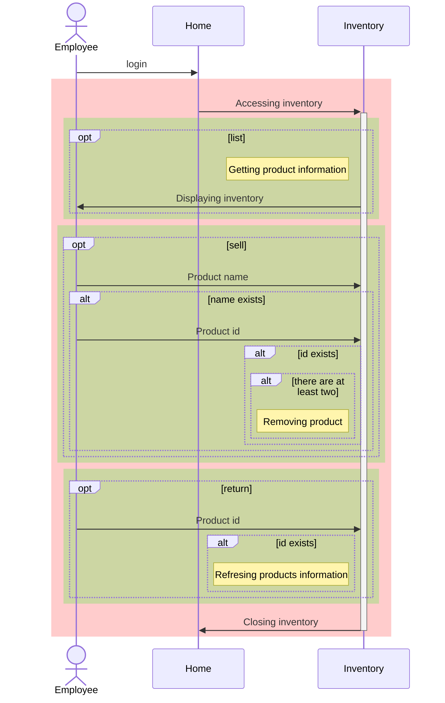

## Administrator - Product 

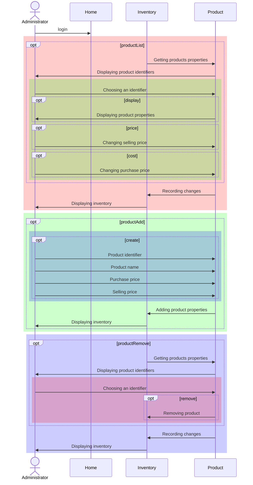

# C. States 

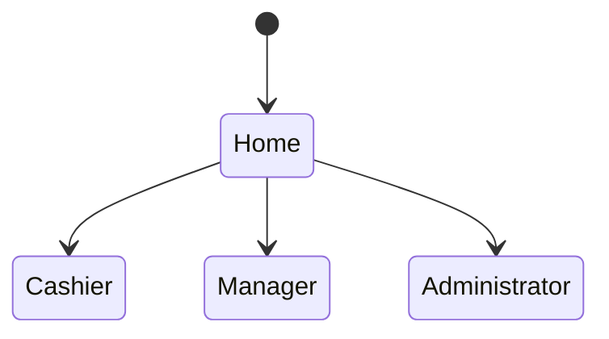

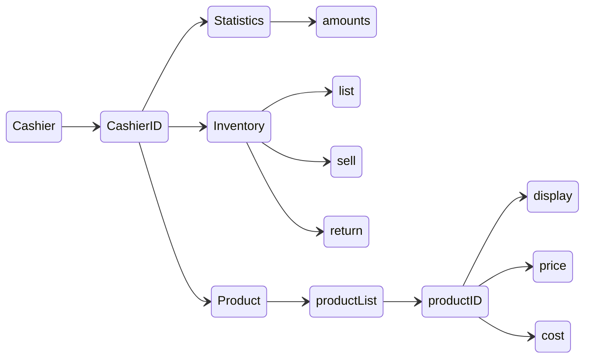

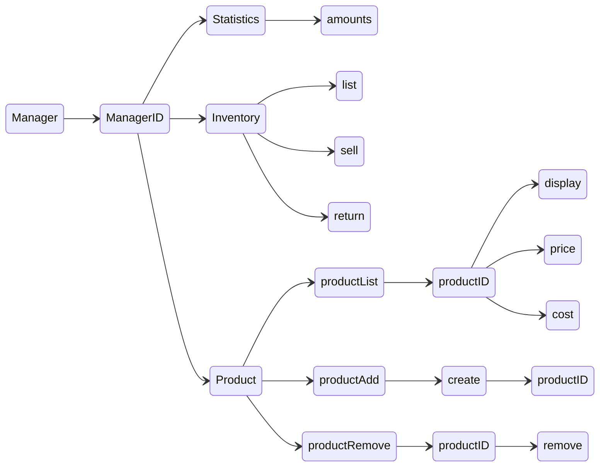

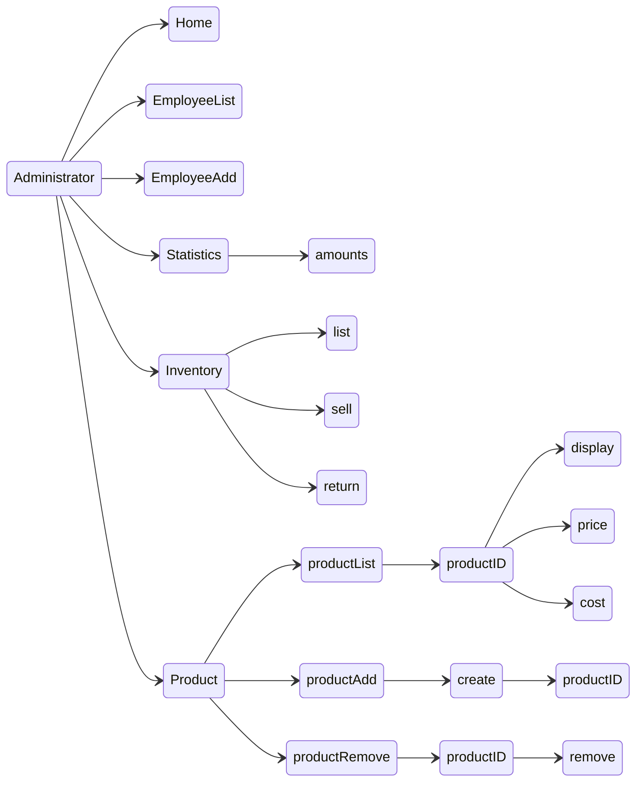

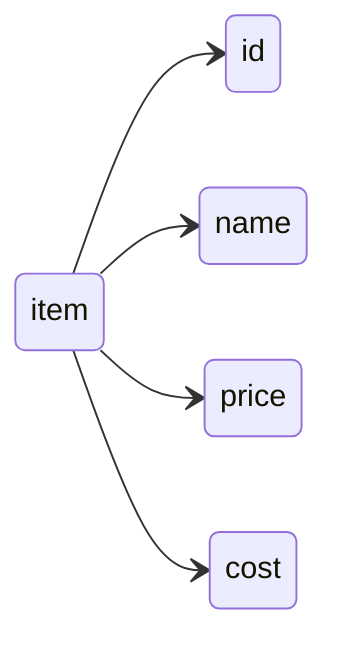

# D. Classes 

## Main 

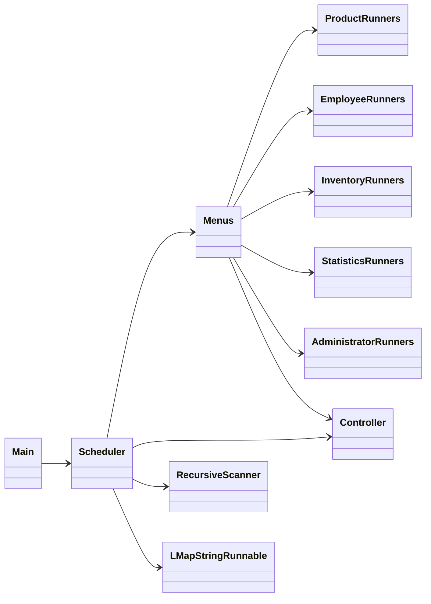

## Administrator 

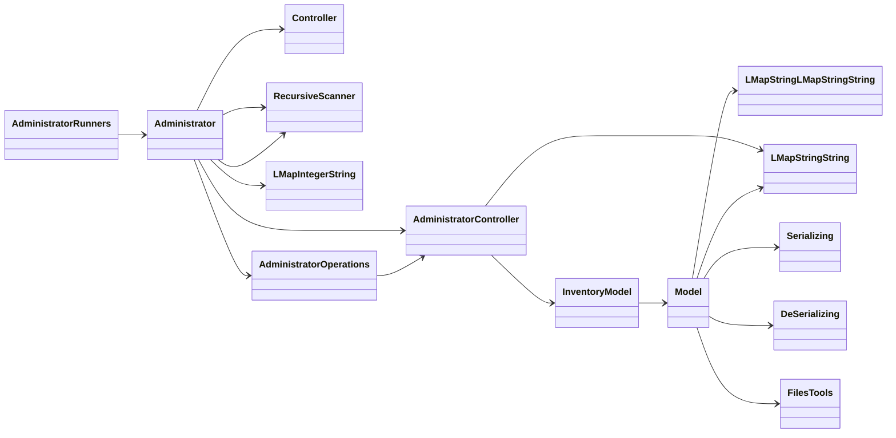

## Inventory 

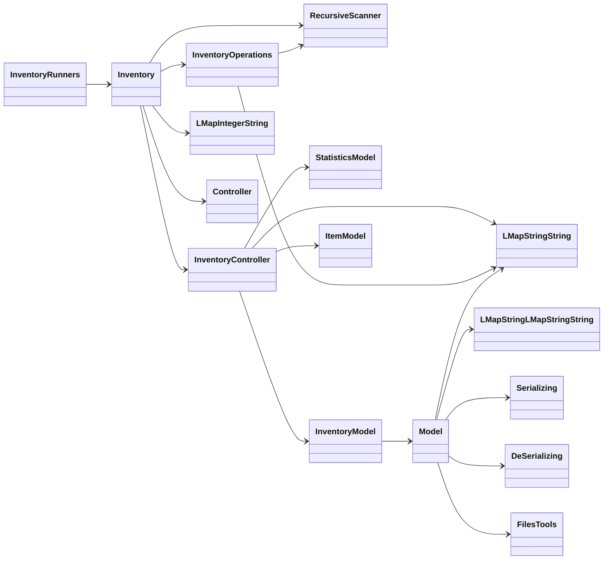

## Employee 

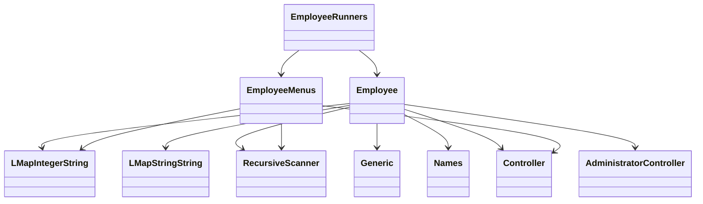

## Product

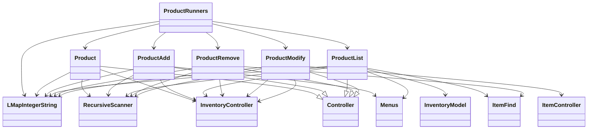

## Details 

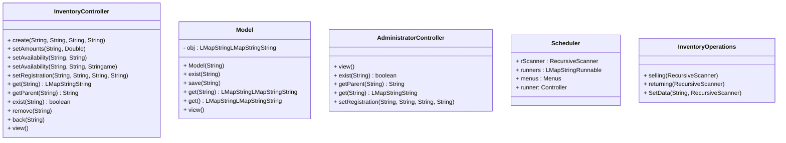

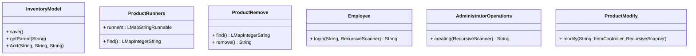

##  Scheduler

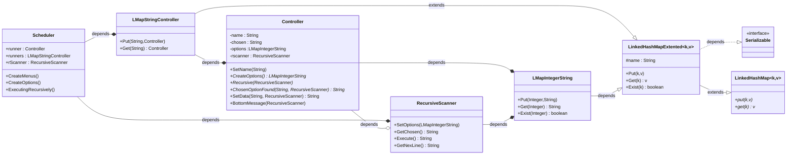
