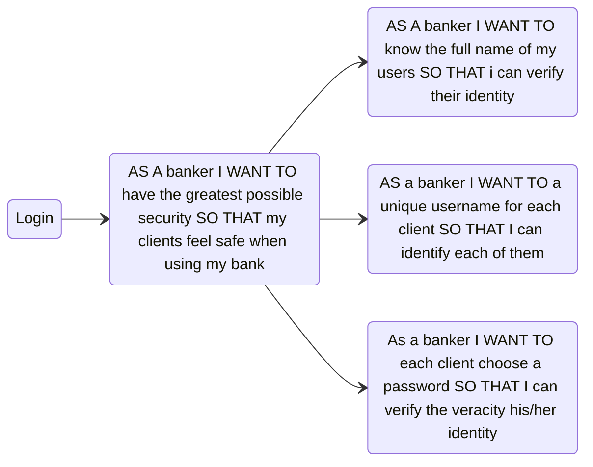
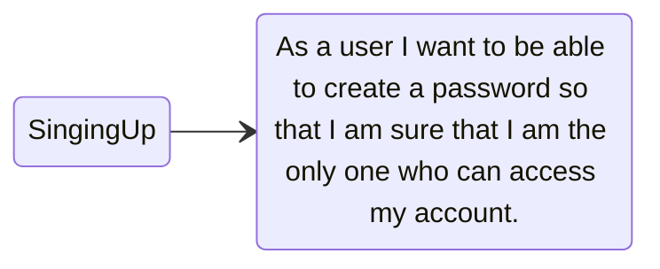
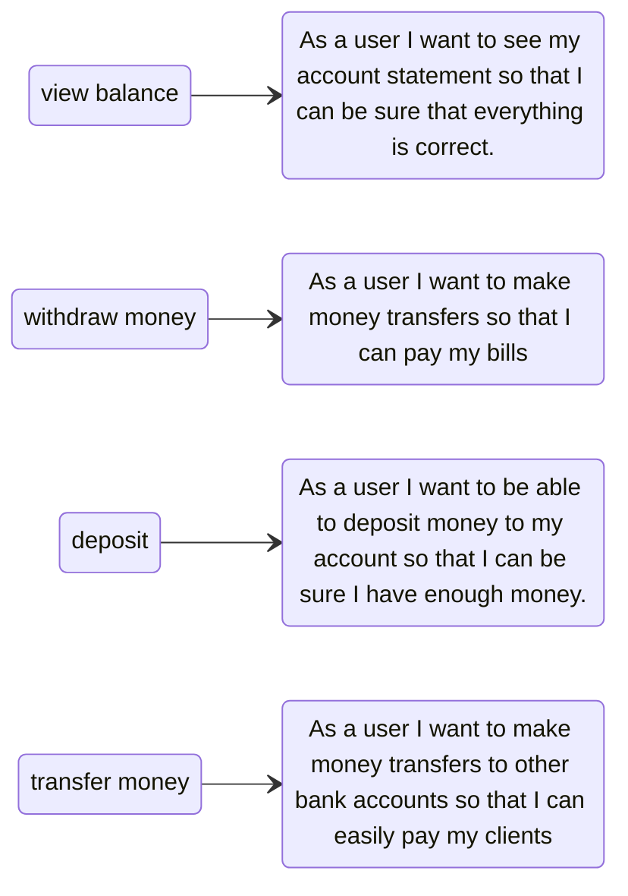
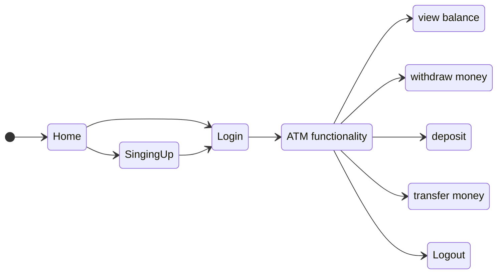
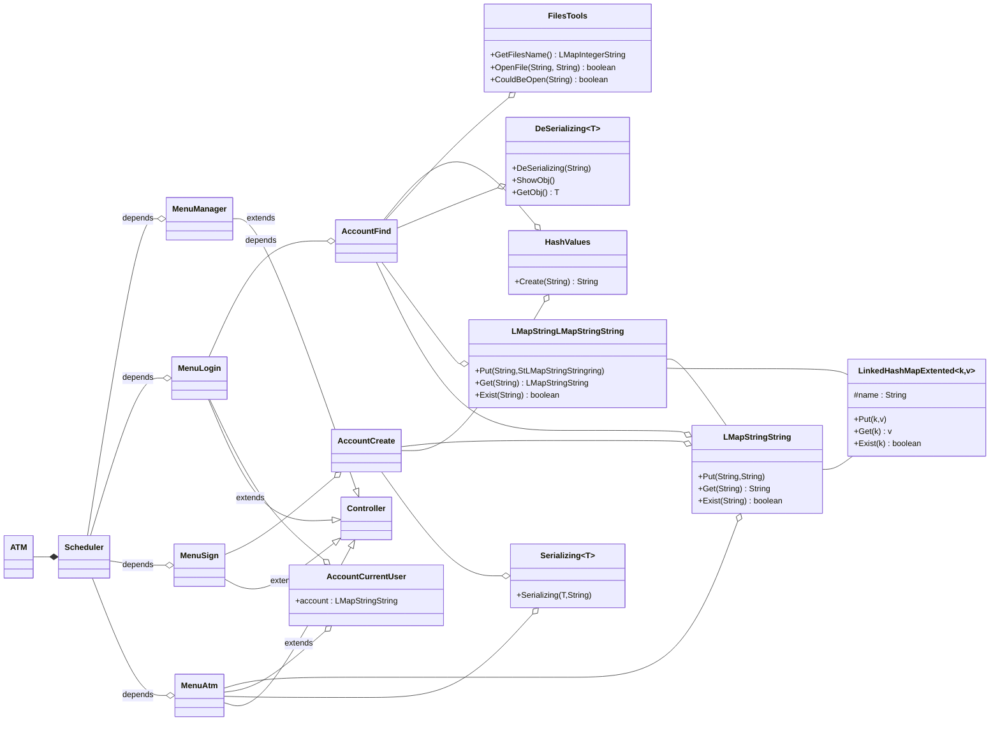

# ATM interface 


This project you emulates the basic functionality of an actual ATM. 

To use the system users need to be authenticated before being allowed into the system. 

The credentials consist of a password and a unique username. 

After entering the correct credentials, users can see their bank details like account balance and perform actions such as transfer, withdraw, deposit and quit. 


[](https://sonarcloud.io/summary/new_code?id=paakat_Dummy)


# 1. Mandatory requirements

### Functionalities

- [x] The home menu will initially offer users two options: 
1. - [x] login , and 
2. - [x] signup.

- [x] The user is prompted to **login** with : 
1. - [x] username, and 
2. - [x] password.

- [x] When **signing up**, a user has to enter : 
1. - [x] full name
2. - [x] username and 
3. - [x] password.

- [x] Once the user is correctly identified in the system, ATM functionalities are unlocked

- [x] ATM functionality must include : 
1. - [x] view balance, 
2. - [x] withdraw money, 
3. - [x] deposit, 
4. - [x] transfer money and 
5. - [x] Logout.  


- [] ??The user interface must display possible options in each stage of the application.


- [] *full name* is unchangeable 


- [] *username* and *password* can change


### Implementation details  


- [] Create different classes for different functionality (i.e. User.java, Account. Java, Transaction.java, etc)

- [x] Code must include data security 

- [x] Code must include reusability features of object oriented concepts.

- [x] Project must verify the authentication code for the user.

- [x] You can use the MessageDigest package to store the password


# 2. User histories and tasks 

## Summary 







## [Jira](https://jmake2.atlassian.net/issues/?jql=created+%3E%3D+-30d+AND+project+%3D+ATM+order+by+created+DESC&atlOrigin=eyJpIjoiMTgyYmQzMDA1NDMyNDZlMjk0NGQ1NGIxY2QxOTRkMGYiLCJwIjoiaiJ9)


# 3. Diagrams 

### State 



### Class 


_Atm_




_Scheduler_


```mermaid
stateDiagram-v2
direction LR 


```

# 4. [Code quality](https://docs.sonarcloud.io/improving/overview/) 

See code smells' long-term risks. The closer a bubble's color is to red, the higher the ratio of technical debt is. Bubble size indicates code smell volume, and each bubble's vertical position reflects the estimated time to address the code smells. Small green bubbles on the bottom edge are best.


